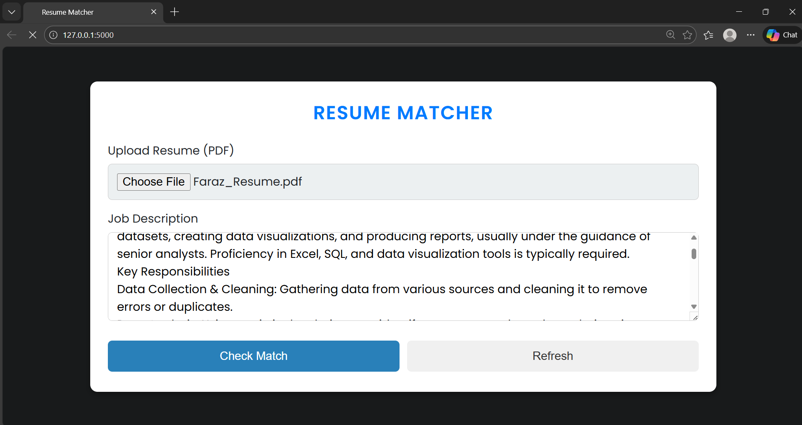
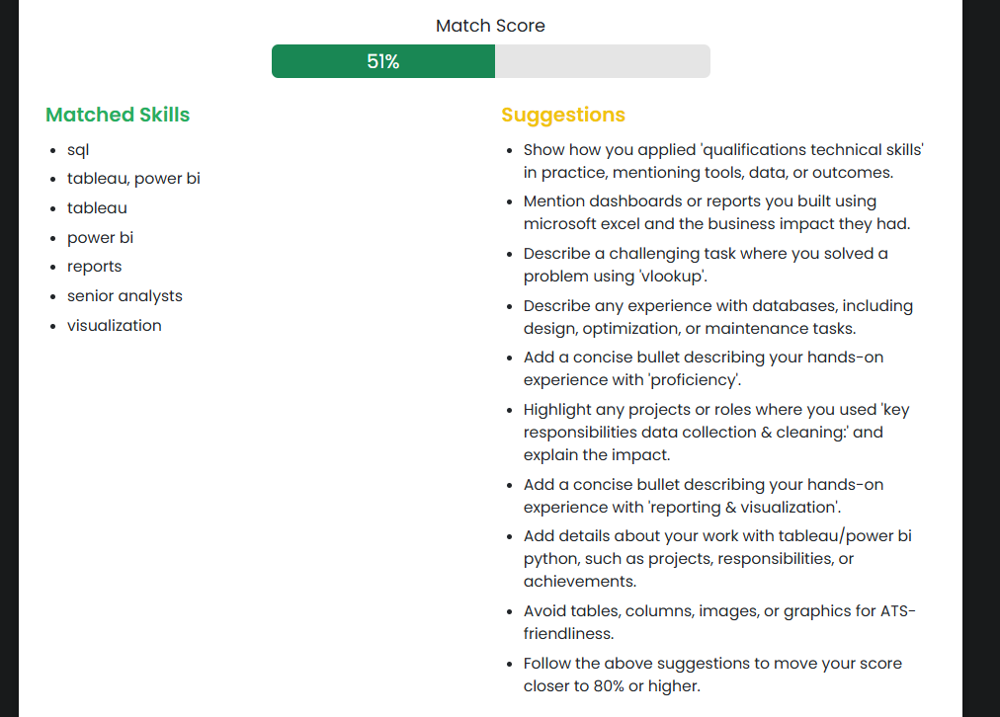

# 🧠 ATS Resume Analyzer

An ATS-style resume–job description matcher built with **Python, Flask, NLP, SentenceTransformers, and spaCy**.  
It analyzes resumes against job descriptions, extracts skills, computes semantic similarity, and provides **match score, matched skills, and improvement suggestions**.

This project is built for learning, hackathons, and portfolio purposes.

---

## 🚀 Features

- Upload **PDF resume**
- Paste **Job Description**
- ATS-style **match score (0–100)**
- Skill extraction from JD
- Matched skills detection
- Missing skill suggestions
- Resume formatting checks (tables, images, length)
- Simple Flask UI

---

## 🖼️ Screenshots

[🖼️ Screenshots](#-screenshots)




---

## 🏗️ Tech Stack

- Python
- Flask
- spaCy
- SentenceTransformers (MiniLM)
- scikit-learn
- PyMuPDF
- HTML + CSS

---

## 📂 Project Structure

```text
Resume_Analyzer/
├── app.py
├── requirements.txt
├── templates/
│   └── index.html
├── static/
│   └── style.css
├── uploads/
└── README.md


